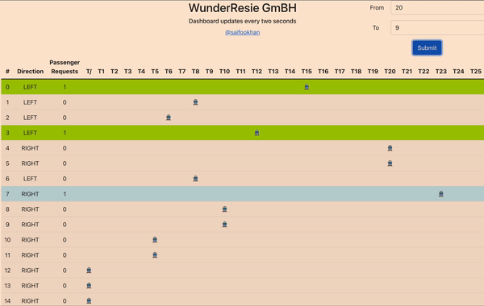

# Coding Challenge - Solution

Railway dispatching system for the WunderReise GmbH. Solution by Saif Imran.
Now online on Heroku: https://moia-challenge-fe.herokuapp.com/

## Solution Specification

### How to run?

There are two main projects to run.

1. Server:
   - `cd src/server`
   - `npm i`
   - `npm run start`
2. UI:
   - `cd src/ui`
   - `npm i`
   - `npm run start`

Then open `http://localhost:3000` in your browser.

#### Requirements:

NodeJS version: v14.17.3

### Overview

- The solution is broken down into two main sections:

  1. server

     - Handles the main business logic of the scheduler.
     - Uess REST apis for endpoints exposure.
     - Code is broken into modules for better readibility.
     - Specific type interfaces are used for return types.

  2. ui
     - compromises of a table view with Train name, terminal info, train direction, number of passengers.
     - the UI updates every two seconds.
     - A form is available for adding a request.

### How algorithm works?

- When a request comes, before assigning to it any train, the algorithm finds out the _Minimum Service Cost_.
- Then the train which is closest from the source (minimum terminal difference) is assigned with that request.
  - For assignment, there is a Queue and the reqest is added to the queue with FIFO system.
  - The queue also handles concurrent requests. e.g.
    - Train is going from 2 to 20
    - Another request comes from 4 to 9
    - The request will be added to the queue of this train because it is already going in this direction.
- The clock tick is incremented with every request of `getAllTrains()` (dashboard update every two seconds).

### What could be done better?

- The `direction` property could be `Boolean` instead of an integer.
- Missed on endpoint where it was asked to change the state of a specific train.
  - How I would've done is that added a reset button. Which will ask all the passengers to get off from the train.
- I also wanted to add the functionality for `requestedTime` but couldn't complete it.

### Challeneges

- Two projects in one repository made it hard to deploy on Heroku.
-

=========

They have the following requirements to be fullfilled

- Furthermore, an endpoint is required that allows a train to update its state within the scheduling system.

- How clean is your design and implementation, how easy it is to understand and maintain your code.
- How you verified your software, if by automated tests or some other way.
